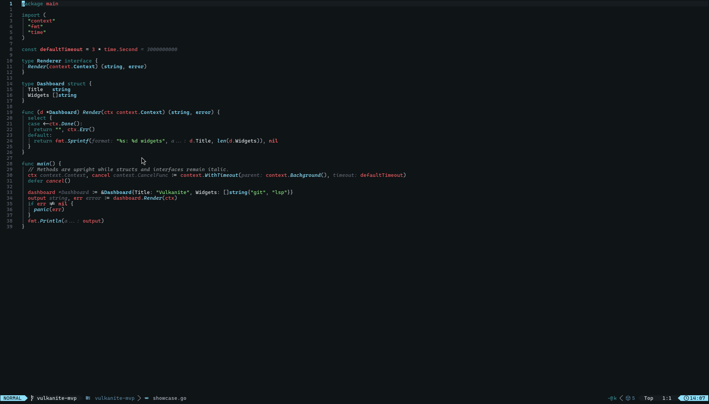
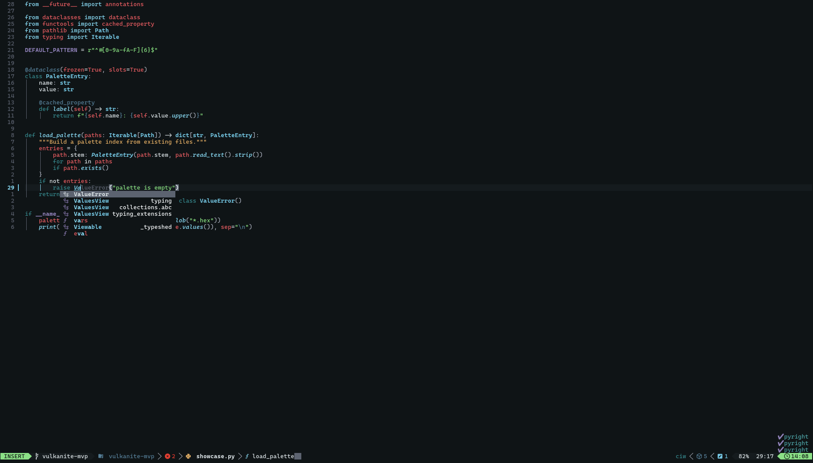
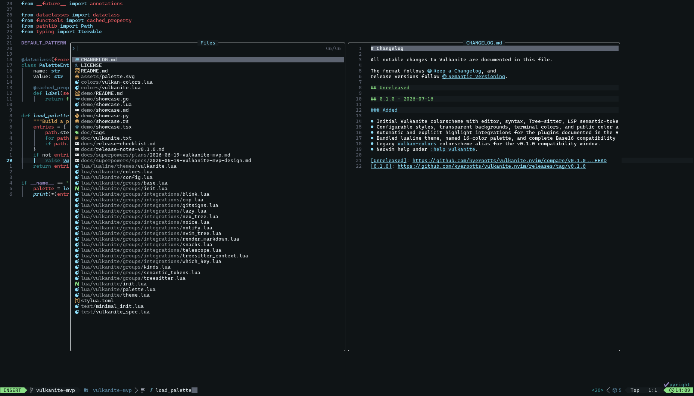
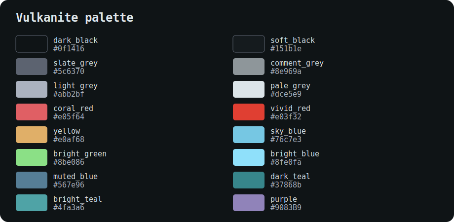

# Vulkanite

[](https://github.com/kyerpotts/vulkanite.nvim/actions/workflows/ci.yml)

Vulkanite is a dark Neovim colorscheme for real cool dudes. If you're a cool dude and you like cool dude colorschemes, maybe Vulkanite is for you.



<p>
  
  
</p>

## Getting started

Neovim 0.10 or later and true-color support is required.

### lazy.nvim

```lua
{
  "kyerpotts/vulkanite.nvim",
  lazy = false,
  priority = 1000,
  config = function()
    require("vulkanite").setup({})
    vim.cmd.colorscheme("vulkanite")
  end,
}
```

### LazyVim

Current LazyVim releases require Neovim 0.11.2 or later. Add this to `lua/plugins/vulkanite.lua` and let LazyVim handle the final colorscheme load:

```lua
return {
  {
    "kyerpotts/vulkanite.nvim",
    lazy = false,
    priority = 1000,
    main = "vulkanite",
    opts = {},
  },
  {
    "LazyVim/LazyVim",
    opts = {
      colorscheme = "vulkanite",
    },
  },
}
```

### Native `vim.pack` (Neovim 0.12+)

```lua
vim.pack.add({
  { src = "https://github.com/kyerpotts/vulkanite.nvim" },
})

require("vulkanite").setup({})
vim.cmd.colorscheme("vulkanite")
```

## Configuration

Call `setup()` before loading the colorscheme if you want to change defaults:

```lua
require("vulkanite").setup({
  transparent = true,
  terminal_colors = true,
  styles = {
    comments = { italic = false },
    functions = { italic = true },
    types = { bold = true },
  },
})

vim.cmd.colorscheme("vulkanite")
```

## Integrations

Vulkanite automatically detects supported plugins installed through lazy.nvim or `vim.pack`. Built-in highlights cover:

- [gitsigns.nvim](https://github.com/lewis6991/gitsigns.nvim)
- [telescope.nvim](https://github.com/nvim-telescope/telescope.nvim)
- [nvim-cmp](https://github.com/hrsh7th/nvim-cmp) and [blink.cmp](https://github.com/saghen/blink.cmp)
- [which-key.nvim](https://github.com/folke/which-key.nvim)
- [lazy.nvim](https://github.com/folke/lazy.nvim)
- [neo-tree.nvim](https://github.com/nvim-neo-tree/neo-tree.nvim) and [nvim-tree.lua](https://github.com/nvim-tree/nvim-tree.lua)
- [noice.nvim](https://github.com/folke/noice.nvim) and [nvim-notify](https://github.com/rcarriga/nvim-notify)
- [snacks.nvim](https://github.com/folke/snacks.nvim)
- [nvim-treesitter-context](https://github.com/nvim-treesitter/nvim-treesitter-context)
- [render-markdown.nvim](https://github.com/MeanderingProgrammer/render-markdown.nvim)

You can enable or disable individual integrations through `plugins`:

```lua
require("vulkanite").setup({
  plugins = {
    telescope = true,
    neo_tree = false,
  },
})
```

For lualine, load Vulkanite first and use the bundled theme:

```lua
require("lualine").setup({
  options = { theme = "vulkanite" },
})
```

## Customization

Use `on_colors` for semantic colors and `on_highlights` for individual groups:

```lua
require("vulkanite").setup({
  on_colors = function(colors)
    colors.accent = "#8be086"
  end,
  on_highlights = function(highlights, colors)
    highlights.NormalFloat = { fg = colors.fg, bg = colors.bg }
  end,
})
```

## Palette



The named 16-color palette and its complete Base16 mapping are available from
Lua:

```lua
local palette = require("vulkanite.palette").get()
local base16 = palette.base16
```

## Documentation

The full option reference, integration keys, callback behavior, palette names,
and compatibility notes are available inside Neovim:

```vim
:help vulkanite
```

You can also read [`doc/vulkanite.txt`](doc/vulkanite.txt) directly.

## Project

Want to help? Read the [contributing guide](docs/CONTRIBUTING.md). You can also
find the [changelog](CHANGELOG.md), [release notes](docs/release-notes-v0.1.0.md),
and [MIT license](LICENSE) here.
